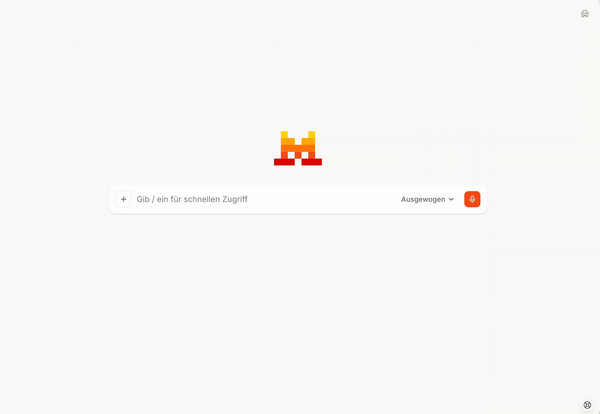
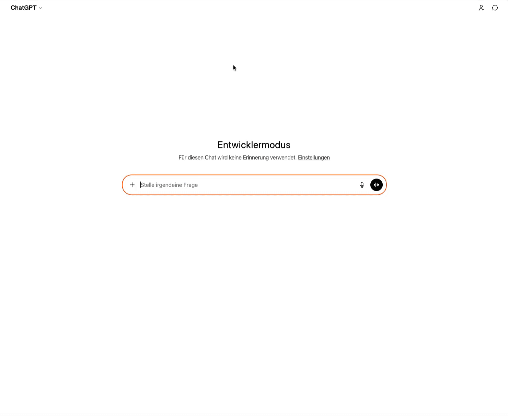

# Open Data MCPs Berlin

A collection of MCP (Model Context Protocol) servers and tools for working with Berlin's open data ecosystem.

## Structure

This repository contains multiple components:

### `/berlin-open-data-mcp`

MCP server for natural language discovery and fetching of Berlin's open datasets. Connects to the Berlin Open Data Portal (daten.berlin.de) and enables:
- Natural language dataset search with smart query expansion
- Data fetching with smart sampling for large datasets
- Format support: CSV, JSON, Excel (XLS/XLSX), GeoJSON, KML, and WFS
- GeoJSON coordinate transformation (EPSG:25833 → WGS84)
- ZIP archive detection (provides direct download URLs)
- Browser automation for JavaScript-rendered downloads

See [berlin-open-data-mcp/README.md](berlin-open-data-mcp/README.md) for details.

### `/datawrapper-mcp`

MCP server for creating data visualizations using the Datawrapper API. Enables automatic chart creation from Berlin open data through conversational AI:
- Bar charts (vertical/horizontal)
- Line charts (single and multi-series)
- Maps (GeoJSON visualization with automatic Berlin bounds)
- Smart defaults for titles, labels, and axes
- Provenance tracking with source dataset links

See [datawrapper-mcp/README.md](datawrapper-mcp/README.md) for setup and API token configuration.

### `/masterportal-mcp`

MCP server for generating ready-to-host [Masterportal](https://www.masterportal.org/) geodata portals. Creates complete zip packages from GeoJSON or WFS data:
- Multi-layer support with configurable styling
- Map configuration (title, center, zoom, basemap)
- Complete Masterportal v3 runtime bundled
- Download as zip, extract to any web server

See [masterportal-mcp/README.md](masterportal-mcp/README.md) for details.

### `/interface-prototype`

Web-based chat interface for exploring Berlin open data through natural language. Integrates the Berlin Open Data MCP server with a Mistral-based chat interface to enable:
- Conversational dataset search and discovery
- Data fetching and preview
- Accurate data analysis via sandboxed JavaScript code execution
- Real-time streaming responses via WebSocket

See [interface-prototype/README.md](interface-prototype/README.md) for setup and usage.

## Using the MCP Servers

The MCP servers are deployed independently and can be used in multiple ways:

### Deployed Services

| Service | URL | Description |
|---------|-----|-------------|
| Berlin Open Data MCP | https://berlin-open-data-mcp.onrender.com/mcp| Dataset search and fetching |
| Datawrapper MCP | https://datawrapper-mcp.onrender.com/mcp | Chart creation |
| Masterportal MCP | not planned | Geodata portal generation |
| Chat Interface | not planned | Web UI combining all MCPs |

## Getting started — Set up

To use the **Open-Data-MCP** and **Datawrapper-MCP** agents, you need at least:

1. **Access to a chat platform** (e.g., Le Chat, ChatGPT, Claude).
2. **An internet connection** (for remote access).

### Mistral Le Chat

Connect from [Le Chat](https://chat.mistral.ai/) using Custom MCP Connectors:

**Requirements:** Mistral account with Le Chat Pro

1. In the left sidebar, click **Intelligence**, then select **Connectors**
2. Click **+ Add Connector**
3. Select the **Custom MCP Connector** tab and fill in the details:
    1. **Berlin Open Data MCP**
        - Name: berlin-open-data
        - MCP Server URL: https://berlin-open-data-mcp.onrender.com/mcp
        - Authentication: No Authentication
    2. **Datawrapper MCP**
        - Name: datawrapper
        - MCP Server URL: https://datawrapper-mcp.onrender.com/mcp
        - Authentication: No Authentication
4. Click **Connect** to save
5. Open a new chat, click **+**, then **Connectors**, and enable the connectors you want to use



### ChatGPT 

1. Open the profile menu and go to **Settings → Apps → Advanced settings**
2. Enable **Developer mode**
3. Click **Create app** (top-right)
4. Fill in the form:
    1. **Berlin Open Data MCP**
        - Name: berlin-open-data
        - Description: Open Data MCP for Berlin
        - MCP Server URL: https://berlin-open-data-mcp.onrender.com/mcp
        - Authentication: No Authentication
    2. **Datawrapper MCP**
        - Name: datawrapper
        - Description: Datawrapper MCP
        - MCP Server URL: https://datawrapper-mcp.onrender.com/mcp
        - Authentication: No Authentication
5. Check the confirmation box, then click **Create**
6. In a new chat, click **+** → **More** and select the app you want to use



❗Make sure you activate the MCP for every new session.

### Claude Desktop

**Requirements:**
- Claude Pro, Team, or Enterprise plan (remote MCP servers not available on free tier)
- Internet connection

Add this to your Claude Desktop configuration file:
- **macOS**: `~/Library/Application Support/Claude/claude_desktop_config.json`
- **Windows**: `%APPDATA%\Claude\claude_desktop_config.json`
- **Linux**: `~/.config/Claude/claude_desktop_config.json`

```json
{
  "mcpServers": {
    "berlin-data": {
      "command": "npx",
      "args": ["mcp-remote", "https://berlin-open-data-mcp.onrender.com/mcp"]
    },
    "datawrapper": {
      "command": "npx",
      "args": ["mcp-remote", "https://datawrapper-mcp.onrender.com/mcp"]
    },
  }
}
```

Restart Claude Desktop after updating the configuration.

### Claude.ai Web

**Requirements:**
- Claude Pro, Max, Team, or Enterprise plan
- Connectors feature access

Connect from [Claude.ai](https://claude.ai/) using Custom Connectors:

1. Go to **Settings** → **Connectors**
2. Click **Add custom connector** at the bottom
3. Add each server:

**Berlin Open Data MCP:**
| Field | Value |
|-------|-------|
| URL | `https://berlin-open-data-mcp.onrender.com/mcp` |
| OAuth | Leave empty |

**Datawrapper MCP:**
| Field | Value |
|-------|-------|
| URL | `https://datawrapper-mcp.onrender.com/mcp` |
| OAuth | Leave empty |

4. Click **Add** to save
5. Open a new chat, click **+**, select **Connectors**, and enable the connectors you want to use
6. When Claude asks to use a tool, click **Allow** (or **Always allow**)

### 🐻 BärGPT

Integration with BärGPT is currently being evaluated

### VS Code

**Requirements:** 

- **VS Code** installed.
- **Basic knowledge of JSON files**

Add to your User Settings or `.vscode/settings.json`:

**Using the hosted endpoint (no install):**

```
{
  "mcpServers": {
    "xxx": {
      "url": "xxx",
      "type": "http"
    }
  }
}
```

**Using local installation:**
```
{
  "mcpServers": {
    "xxx": {
      "command": "npx",
      "args": ["xxx"]
    }
  }
}
```


## Having troubles? — FAQ and troubleshooting

- How to I activate the MCP in the LLM of my choice?
    
    Some chat platforms (e.g. ChatGPT) require you to **reactivate the MCP connectors in every new session**. Here’s how:
    
    1. Start a new chat.
    2. Click **+** (or "Apps"/"Connectors").
    3. Enable the **Berlin Open Data MCP** and/or **Datawrapper MCP** connectors.
    
    
- What data sources does the AI agent draw on?
    
    The **Open-Data-MCP** agent accesses datasets exclusively from the [Berlin Open Data Portal](https://daten.berlin.de/), which includes over 2500 public datasets on topics like transportation, environment, demographics, and urban planning. 
    
    The **Datawrapper-MCP** agent uses the data you provide (e.g., from Open-Data-MCP or your own files) to create visualizations, it does not pull additional external data. 
    
- What kind of data sets can the AI agent read and analyse?
    
    The **Open-Data-MCP** and **Datawrapper-MCP** agents support a wide range of common data formats, including:
    
    - **Tabular Data:** CSV, Excel (XLS/XLSX), JSON
    - **Geospatial Data:** GeoJSON, KML, WFS (Web Feature Service) layers
    - **Structured Data:** APIs or datasets with clear columns and rows
    
    If the dataset is really large, the agent might have troubles in processing in directly and a manual download and upload is necessary. 
    
- Can values from existing datasets be aggregated and new tables generated?
    
    **Yes!** The **Open-Data-MCP** agent can aggregate values from datasets—such as sums, averages, counts, or grouped breakdowns—and generate new tables with the results. 
    
- Is there a maximum limit on file sizes or table entries for downloading and processing?
    
    Yes, the **Open-Data-MCP** agent can process datasets up to **1000 rows** or **5000 WFS features** directly for preview, analysis, or aggregation. For larger datasets, you’ll need to download the file manually and, if necessary, filter or preprocess it before uploading it for further analysis. This limit ensures quick and reliable performance while handling most common use cases.
    
- Can geo-datasets be analysed and processed?
    
    Yes, the agents can:
    
    - Analyze **GeoJSON, KML, and WFS** data (e.g., school locations, air quality zones).
    - Create **maps or summaries** (e.g., "Count of trees per district").
    
    If you want to check out more helpful tools, have a look here: 
    
    - Preview GeoJSON: [geojson.io](https://geojson.io/next/)
    - Explore WFS layers: [WFS Explorer](https://wfsexplorer.netlify.app/)

- The download link doesn’t work.
    
    Try these steps:
    
    1. **Check your internet connection**.
    2. **Refresh the page** or restart your chat tool.
    3. **Manually download** the dataset from [daten.berlin.de](https://daten.berlin.de/) and upload it to the agent.
    
    *☝🏼 Also, try asking the agent why the link isn't working.*

**Open Data MCP**

- How do I search for datasets?
    
    Use **natural language** (e.g., German/English):
    
    - *“Find datasets about public transport in Pankow.”*
    - *“Show me air quality data from 2023 as CSV.”Tip:* Use filters like **tags** (e.g., “Luftqualität”) or **organizations** (e.g., “SenUVK”).

- Why can’t the agent find my dataset?
    
    Possible reasons:
    
    - **Typo in your query**: Try simpler terms (e.g., “schools” instead of “educational institutions”).
    - **Dataset not machine-readable**: PDFs or scanned files can’t be processed.
    - **Portal delay**: Berlin’s open data syncs weekly—check [daten.berlin.de](https://daten.berlin.de/) for updates.

- Can I analyze data from other cities or countries with the Open Data MCP?
    
    No. The **Open-Data-MCP** only accesses **Berlin’s open data portal**. For other regions, you’d need a manual data upload.

**Data Wrapper MCP**

- What do I need to do to create a data visualisation in Datawrapper?
    
    Make sure that you have completed the set up with the API tokens and selected the required permissions (see above).
    
    Once you’ve done that you can simply as the agent for whatever visualisation you aim for, for example “Create a bar chart showing the number of nurseries per district”
    
- What types of graphics can be generated?
    
    The **Datawrapper-MCP** supports:
    
    - **Bar Charts**: Horizontal bars with variants (basic, stacked, split)
    - **Column Charts**: Vertical columns with variants (basic, grouped, stacked)
    - **Line Charts**: Single and multi-series line charts for time-series data
    - **Area Charts**: Filled area charts
    - **Scatter Plots**: X/Y scatter plots for correlation analysis
    - **Dot Plots**: Horizontal dot plots with legend
    - **Range Plots**: Show min/max ranges with labeled endpoints
    - **Arrow Plots**: Show change direction between two values
    - **Pie & Donut Charts**: Part-to-whole visualizations
    - **Election Donuts**: Parliament-style seat distribution charts
    - **Tables**: Formatted data tables
    - **Maps**: GeoJSON visualization (symbol maps, choropleth)
    
    *Need help choosing?* Ask: *“What’s the best chart for my data?”*
    
    
    
- Why can’t I access datawrapper?
    
    Check these:
    
    1. **API token**:
        - Is it correctly entered in your connector settings?
        - Did you include it in the current chat session?
    2. **Permissions**: Your token needs these rights:
        - `chart:read`, `chart:write`, `theme:read`, `user:read`, `visualization:read`
    3. **Account status**: Ensure your [Datawrapper account](https://app.datawrapper.de/) is active.

**Helpful Sidefacts for total beginners**

- What are JSON and GeoJSON files?
    
    **JSON** (JavaScript Object Notation) is a simple format to store data.
    
    **GeoJSON** is a standard format for encoding geographic data using JSON (JavaScript Object Notation), making it easy to store and share location-based information like points, lines, and polygons.
    
    Tools like [geojson.io](http://geojson.io) can help you to preview GeoJSON files on a map. 
    
- How can I open a WFS File?
    
    To visualize, analyze or export a WFS file the AI agent has found, the [WFS explorer](https://wfsexplorer.netlify.app/) might be helpful to you. 
    
- Can I use the agent without coding skills?
    
    Give it a try, the agents are designed for non-technical users: 
    
    1. Ask in plain language (German/English).
    2. Follow the step-by-step guides in this FAQ.
    3. Also, try asking the agent for assistance.

## Limitations

To assess the quality of the individual features, we’ve carried out tests both automatically and manually using an AI programme of our choice. Below are some limitations of the agent we’ve encounterd during the testing process: 

- The agent may generate **incorrect or incomplete answers**, particularly when datasets are too large for the agent to analyse directly. Make sure to always double-check the answers that are generated.
- In case the datasets is too large (more than around 2000 entries) it may be necessary to download and upload the file manually, as the AI cannot analyse them directly.
- Sometimes the retrieval of WFS Features is not possible.
- In some cases the retrieval and aggregation of CSV data is not possible, especially with large datasets.
- This is not a limitation of the MCP agent itself, but of course if the data sources such as  the Berlin Open Data Portal lack machine-readable datasets, even the AI cannot work with that information. This underlines the importance of providing machine-readable data.
